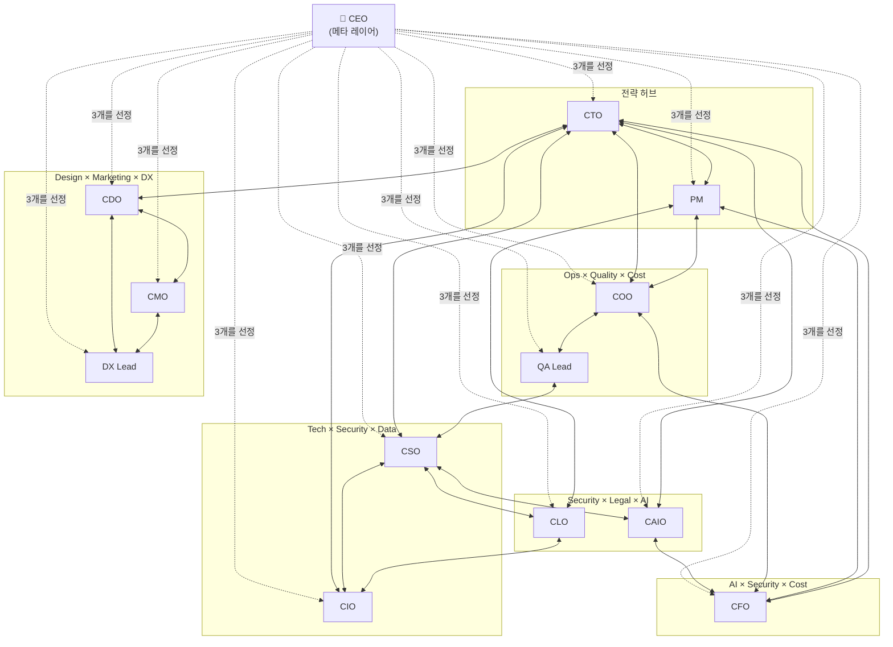

# Claude CEO-Suite Plugin


모든 코드베이스에 경영진의 시각을. 13개의 전문 리뷰 커맨드와 최적의 CxO로 자동 배분하는 라우터(`/ask`)가 다양한 리더십 관점에서 프로젝트를 분석합니다.


## 60초 퀵스타트

```bash
/plugin marketplace add gaebalai/claude-ceo-suite-plugin
/plugin install claude-ceo-suite
```

임의의 git 리포지토리에서:

```
/claude-ceo-suite:ceo
```

CEO 커맨드가 자동으로 프로젝트를 진단하고, 가장 관련성이 높은 3개의 경영 관점을 선택하여 우선순위가 매겨진 액션 리스트를 반환합니다. **어디서 시작할지 모르겠다면 `/ceo`부터 시작하세요** — 항상 올바르고 안전한 진입점으로 설계되어 있습니다.

상세한 사용 가이드(의사결정 트리, 자주 쓰는 패턴, 복수 역할 상담, 플러그인 병용, 트러블슈팅)는 **[USAGE.md](./USAGE.md)**를 참조하세요.

## 커맨드 목록

| 커맨드 | 직책 | 리뷰 대상 |
|----------|------|-------------|
| `/ceo` | CEO(메타 레이어) | 니즈에 대해 최적의 3명의 CxO를 선정하고, 통합적인 경영 판단을 내림 |
| `/ask` | CEO-Suite 라우터 | 질문을 최적의 1명의 CxO에게 자동 배분하여 해당 단일 관점으로 답변 |
| `/cto` | 최고기술책임자 | 기술 부채, 아키텍처, 리팩토링 우선순위, 의존성 리스크 |
| `/pm` | 프로덕트 매니저 | 마일스톤 정리, Issue 우선순위, 릴리스 계획 |
| `/cdo` | 최고디자인책임자 | UI/UX 일관성, 디자인 시스템, 컴포넌트 재사용 |
| `/cso` | 최고보안책임자 | 취약점, 인증 패턴, 시크릿 관리, OWASP Top 10 |
| `/clo` | 최고법무책임자 | 라이선스 준수, 데이터 프라이버시, 규제 대응, 지적재산 보호 |
| `/coo` | 최고운영책임자 | CI/CD 파이프라인, 배포 전략, 관측 가능성, 장애 대응 체계 |
| `/cmo` | 최고마케팅책임자 | SEO, Core Web Vitals, SNS 공유, 애널리틱스 구현 |
| `/caio` | 최고AI책임자 | AI/ML 거버넌스, 모델 라이프사이클, 책임 있는 AI, LLM 통합 |
| `/cfo` | 최고재무책임자 | 클라우드 비용 최적화, 리소스 효율, 과금 로직, 컴퓨팅 자원 낭비 |
| `/cio` | 최고정보책임자 | 데이터 거버넌스, 시스템 통합, 정보 아키텍처, 스키마 관리 |
| `/qa-lead` | QA 리드 | 테스트 커버리지, 품질 메트릭스, 테스트 전략의 허점 |
| `/dx-lead` | DX 리드 | 개발자 경험, API 인체공학, SDK 사용성, 온보딩 |

## 각 역할 상세

### CEO(메타 레이어)와 라우터

- **CEO** — 상관도의 위에 서는 메타 레이어. 사용자의 니즈를 분석하고, 11개 역할 중 가장 적합한 3개의 CxO 관점을 선정. 각 관점에서 분석한 후 합의점·대립점·트레이드오프를 통합하여 경영 판단을 도출. 전문 지식이 아닌 **어떤 전문가에게 물어야 하는지**를 판단. *"The right 3 perspectives beat all 11 spread thin(적절한 3개의 관점이 11개 전부를 얕게 보는 것보다 강하다)"*
- **`/ask`(라우터)** — `/ceo`의 경량 버전. 하나의 질문을 **최적의 1명**의 CxO/Lead에게 자동 배분하여 해당 단일 관점으로 답변. 「질문은 있지만 누구에게 물어야 할지 모르겠을 때」 사용. `/ceo`보다 저렴하고(1관점 vs 3관점), 각 역할 직접 호출보다 간편(조직도를 외울 필요 없음). 질문이 정말로 복수 관점의 통합을 필요로 하는 경우, 라우팅을 거부하고 `/ceo`로 리다이렉트. *"One sharp lens beats three blurry ones(날카로운 1관점이 흐릿한 3관점을 이긴다)"*

### 전략·경영

- **CTO** — 코드베이스의 건전성을 지킴. 시간이 지남에 따라 복리로 불어나는 기술 부채를 식별하고, 아키텍처 판단을 평가하며, 리팩토링의 우선순위를 결정. *"Debt compounds(부채는 복리로 불어난다)"*
- **PM** — 릴리스로의 조타. 마일스톤을 정리하고, Issue를 임팩트 순으로 나열하며, 기능 추가보다 버그 수정을 우선. *"Bugs before features(버그 수정이 먼저)"*
- **CFO** — 낭비를 추적. N+1 쿼리, 유휴 리소스, 캐시 부재를 발견하고, 과금 로직의 정확성을 감사. *"Every query has a price tag(모든 쿼리에는 비용이 따른다)"*
- **CIO** — 정보 아키텍처를 통치. 데이터 모델, 스키마 건전성, 마이그레이션 안전성, 시스템 통합 계약, 데이터 라이프사이클을 리뷰. *"Schema is the contract between past and future(스키마는 과거와 미래의 계약)"*

### 보안·법무

- **CSO** — 공격자의 시점으로 생각. 인증 플로우를 감사하고, 하드코딩된 시크릿을 스캔하며, OWASP Top 10에 비추어 의존성을 검사. *"Secrets are toxic(시크릿은 독물)"*
- **CLO** — 법적 리스크를 제거. 의존성의 라이선스 트리를 매핑하여 카피레프트 충돌을 검출하고, GDPR/CCPA 대응을 평가하며, IP 출처를 검증. *"Licenses are viral(라이선스는 전염된다)"*

### 프로덕트·디자인

- **CDO** — 디자인의 일관성을 강제. 컴포넌트 재사용, 디자인 토큰 준수, 앱 전체의 UX 정합성을 리뷰. *"Components are contracts(컴포넌트는 계약)"*
- **CMO** — 프로덕트를 발견 가능하게. SEO 기본, Core Web Vitals, OGP/SNS 공유, 애널리틱스 구현 상태를 검사. *"Speed is conversion(속도는 전환율)"*

### 운영·AI

- **COO** — 프로덕션 환경을 안정적으로 운영. CI/CD 파이프라인, 배포 전략, 관측 가능성 커버리지, 장애 대응 체계를 감사. *"Deploys should be boring(배포는 지루해야 한다)"*
- **CAIO** — AI를 책임감 있게 통치. 모델 라이프사이클, 프롬프트 엔지니어링 품질, 바이어스 검출, 평가 기반, 가드레일을 리뷰. *"Prompts are production code(프롬프트는 프로덕션 코드)"*

### 리드(CxO 산하)

- **QA Lead** — 테스트의 허점을 메움. 커버리지를 측정하고, 부족한 테스트 시나리오를 식별하며, 테스트 전략을 전체적으로 평가. *"Every bug is a missing test(버그는 테스트의 부재)"*
- **DX Lead** — 개발자의 행복을 지킴. API 인체공학, 에러 메시지, SDK 사용성, 온보딩의 마찰을 리뷰. *"Pit of success(올바른 방법이 가장 쉬워야 한다)"*

## 설치

```bash
/plugin marketplace add gaebalai/claude-ceo-suite-plugin
/plugin install claude-ceo-suite
```

### 필요한 GitHub 토큰 스코프

플러그인은 Issue·마일스톤·라벨을 읽기 위해 `gh` 명령을 실행합니다. 대부분의 커맨드는 읽기 전용이며, `/pm`만이 사용자의 명시적 승인을 거친 후 쓰기 작업(`gh issue create`, `gh issue edit`)을 제안합니다.

| 용도 | 권장 스코프 |
|------|-------------|
| 공개 리포지토리만 | `public_repo` |
| 비공개 리포지토리 | `repo` |
| 조직 리포지토리 | `repo` + `read:org` |

완전한 위협 모델과 취약점 보고 프로세스는 [SECURITY.md](./SECURITY.md)를 참조하세요.

## 사용법 개요

> 상세 가이드: **[USAGE.md](./USAGE.md)** 

### 리뷰 모드 — 전체 또는 범위 지정 분석

```
/claude-ceo-suite:ceo                   # 자동 진단 후 경영 서머리 출력
/claude-ceo-suite:cto                   # 현재 리포를 CTO로서 전체 리뷰
/claude-ceo-suite:cto debt              # 기술 부채만 집중
/claude-ceo-suite:cso auth              # 인증에 집중
/claude-ceo-suite:clo licenses          # 의존성 라이선스에 집중
/claude-ceo-suite:coo cicd              # CI/CD 파이프라인에 집중
/claude-ceo-suite:cmo seo               # SEO에 집중
/claude-ceo-suite:caio models           # 모델 라이프사이클에 집중
/claude-ceo-suite:cfo costs             # 클라우드 비용에 집중
/claude-ceo-suite:cio data              # 데이터 거버넌스에 집중
```

### 질문 모드 — 자연어로 질문

각 역할은 자연어 질문에 대해 실제 코드베이스에 기반하여 해당 직책의 관점에서 답변합니다:

```
/claude-ceo-suite:ask 이 SQL 스키마는 정규화되어 있나요?
/claude-ceo-suite:ask 새로 추가한 의존성은 얼마나 위험한가요?
/claude-ceo-suite:ceo 런칭 전에 무엇을 체크해야 하나요?
/claude-ceo-suite:cto 모노레포로 전환해야 할까요?
/claude-ceo-suite:pm 이 버그를 고치기 위해 릴리스를 연기해야 할까요?
/claude-ceo-suite:cso JWT 구현이 안전한가요?
/claude-ceo-suite:clo 이 GPL 라이브러리를 SaaS 프로덕트에서 사용할 수 있나요?
/claude-ceo-suite:cfo 데이터베이스 티어가 오버프로비저닝되어 있나요?
/claude-ceo-suite:caio 프롬프트 인젝션 리스크에 대응하고 있나요?
```

## 상호참조 맵

각 역할은 가장 밀접하게 협업하는 **Top 3** 역할을 크로스 레퍼런스합니다. CEO는 메타 레이어로서 상관 그래프를 읽고, 니즈에 맞는 적절한 관점을 선정합니다.

```
┌──────────────────────────────────────────────────────────┐
│  CEO(메타 레이어)                                         │
│  상관 그래프를 조감. 니즈에 맞춰 3개의 관점을 선정.        │
│  부문 횡단적 경영 판단을 통합.                             │
└────────────────────────────┬─────────────────────────────┘
                             │
─────────────────────── CxO Level ─────────────────────────

   Tech×Security×Data     Strategy Hub     AI×Security×Cost
   ┌─────┐                                  ┌──────┐
   │ CIO │◀──┐          ┌──────┐     ┌────▶│ CAIO │
   └──┬──┘   │    ┌────▶│  PM  │◀──┐ │     └──┬───┘
      │      │    │     └──────┘   │ │        │
      ▼      │    │                │ │        ▼
   ┌─────┐   │  ┌─┴────┐      ┌───┴─┴─┐  ┌──────┐
   │ CSO │◀──┼─▶│ CTO  │      │  CFO  │◀▶│ COO  │
   └──┬──┘   │  └──┬───┘      └───────┘  └──┬───┘
      │      │     │                         │
      ▼      │     ▼   Design×Marketing×DX   ▼
   ┌─────┐   │  ┌─────┐   ┌─────┐      ┌────────┐
   │ CLO │◀──┘  │ CDO │◀─▶│ CMO │      │QA Lead │
   └─────┘      └──┬──┘   └──┬──┘      └────────┘
                   │         │
                   ▼         ▼
                ┌─────────────┐
                │   DX Lead   │
                └─────────────┘

─────────────────────── Lead Level ────────────────────────
```

| 임원 | Top 3 협업 대상 | 클러스터 |
|------|-------------|---------|
| CTO | PM, CSO, CIO | 전략 허브 |
| PM | CTO, CFO, COO | 전략 × 운영 |
| CDO | CTO, CMO, DX Lead | 디자인 × 마케팅 × DX |
| CSO | CTO, CLO, CAIO | 보안 × 법무 × AI |
| CLO | CSO, CIO, PM | 법무 × 데이터 × 전략 |
| COO | CTO, QA Lead, CFO | 운영 × 품질 × 비용 |
| CMO | CDO, CTO, DX Lead | 마케팅 × 디자인 × DX |
| CAIO | CTO, CSO, CFO | AI × 보안 × 비용 |
| CFO | CTO, CAIO, COO | 비용 × AI × 운영 |
| CIO | CTO, CSO, CLO | 데이터 × 보안 × 법무 |
| QA Lead | CTO, COO, CSO | 품질 × 운영 × 보안 |
| DX Lead | CTO, CDO, CMO | DX × 디자인 × 마케팅 |

모든 임원은 [PhD Panel](https://github.com/gaebalai/claude-phd-panel-plugin)(학술적 리뷰)의 분석 결과도 참조할 수 있습니다.



## 설계 사상

- **분석만 수행** — 변경을 실행하지 않고, 액션을 권장만 함
- **상호참조** — 같은 세션에서 여러 커맨드를 실행하면 서로의 분석 결과를 참조
- **GitHub 연동** — `gh` CLI로 Issue, 마일스톤, 커밋 이력을 수집
- **범용적** — 프로젝트 고유의 전제 없음. 모든 코드베이스에서 동작

## 문서

| 문서 | 용도 |
|------|------|
| [USAGE.md](./USAGE.md)  | 전체 사용 가이드 — 퀵스타트, 의사결정 트리, 패턴, 트러블슈팅 |
| [SECURITY.md](./SECURITY.md) | 위협 모델, 경감 조치, GitHub 토큰 스코프, 취약점 보고 |
| [CONTRIBUTING.md](./CONTRIBUTING.md) | 스타일 가이드, 기능 동결 정책, PR 워크플로우 |
| [CHANGELOG.md](./CHANGELOG.md) | 릴리스 이력(v1.0 → 현재) |
| [AUDIT.md](./AUDIT.md) | 정합성 감사 매트릭스 및 검증 스크립트(`python3 scripts/audit.py`) |

## 관련 플러그인
준비중

## 라이선스

MIT
